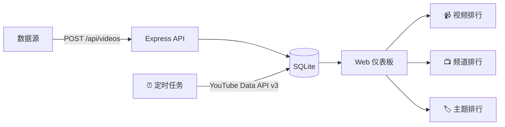

# YouTube 爆款数据展示平台 — 实施方案

## 概述

部署在 VPS 上的 YouTube 爆款视频数据分析平台。支持 API 推送数据，**自动通过 YouTube API 每日刷新播放量**，提供三大核心视图：**视频排行**、**频道排行**、**主题排行**。

## 系统架构



## 三大核心页面

### 页面 1：视频排行 📹

| 筛选项 | 说明 |
|--------|------|
| 视频类型 | Shorts / Long Videos 切换 |
| 发布时间 | This Week / This Month / 自定义范围 |
| 关键词搜索 | 标题模糊搜索 |

| 表格列 | 说明 |
|--------|------|
| # 排名 | 按播放量排序序号 |
| 缩略图 | 视频封面图 |
| 标题 | 视频标题（可点击跳转 YouTube） |
| 发布日期 | Publish Date |
| 频道 | 频道名 + 头像 |
| 播放量 | 格式化显示（32.8M） |
| 关键词/主题 | 标签（cartoon, brainrot, very cute 等） |
| 类型标签 | Short / Regular 彩色标签 |

---

### 页面 2：频道排行 📺

| 筛选项 | 说明 |
|--------|------|
| 指标切换 | Views / Subscribers |
| 排行类型 | Total / Growth（增长量） |

| 表格列 | 说明 |
|--------|------|
| Rank | 排名序号（彩色徽章） |
| Channel | 频道名称 |
| Videos | 视频数量 |
| Subs | 订阅人数 |
| Total Views | 总播放量 |
| Daily Views | 日增播放（绿色高亮） |
| Daily Subs | 日增订阅 |
| Country | 国家标识 |
| Latest Videos | 最近视频缩略图组 |

---

### 页面 3：主题/关键词排行 🏷️

- **顶部主题卡片** — 可选择主题（Spy x Family, K-Pop, Harry Potter, Brainrot, Roblox 等），点击切换筛选
- **数据表格** — 该主题下的视频排行，含缩略图、标题、发布日期、频道、播放量、类型

---

## 数据模型

### videos 表

| 字段 | 类型 | 说明 |
|------|------|------|
| `id` | INTEGER PK | 自增主键 |
| `video_url` | TEXT UNIQUE | 视频地址 |
| `title` | TEXT | 标题 |
| `thumbnail_url` | TEXT | 缩略图 URL |
| `view_count` | INTEGER | 播放量 |
| `video_type` | TEXT | 'short' / 'regular' |
| `channel_name` | TEXT | 频道名 |
| `channel_avatar_url` | TEXT | 频道头像 |
| `publish_date` | TEXT | 发布日期 |
| `collect_date` | TEXT | 采集日期 |
| `keyword` | TEXT | 主题/关键词标签 |
| `country` | TEXT | 国家 |
| `notes` | TEXT | 备注 |
| `is_highlighted` | INTEGER | 高亮标记 |
| `created_at` | DATETIME | 入库时间 |

### channels 表

| 字段 | 类型 | 说明 |
|------|------|------|
| `id` | INTEGER PK | 自增主键 |
| `channel_name` | TEXT UNIQUE | 频道名 |
| `channel_url` | TEXT | 频道链接 |
| `avatar_url` | TEXT | 头像 |
| `subscriber_count` | INTEGER | 订阅数 |
| `total_views` | BIGINT | 总播放量 |
| `video_count` | INTEGER | 视频数 |
| `daily_views` | INTEGER | 日增播放 |
| `daily_subs` | INTEGER | 日增订阅 |
| `country` | TEXT | 国家 |
| `joined_date` | TEXT | 加入日期 |
| `updated_at` | DATETIME | 更新时间 |

### topics 表

| 字段 | 类型 | 说明 |
|------|------|------|
| `id` | INTEGER PK | 自增主键 |
| `name` | TEXT UNIQUE | 主题名称 |
| `cover_url` | TEXT | 主题封面图 |
| `created_at` | DATETIME | 创建时间 |

### view_history 表（播放量变化追踪）

| 字段 | 类型 | 说明 |
|------|------|------|
| `id` | INTEGER PK | 自增主键 |
| `video_id` | INTEGER FK | 关联 videos.id |
| `view_count` | INTEGER | 当次抓取的播放量 |
| `recorded_at` | DATETIME | 记录时间 |

---

## API 端点

### 数据推送（需 API Key）

| 方法 | 路径 | 说明 |
|------|------|------|
| POST | `/api/videos` | 推送视频数据（支持数组批量） |
| POST | `/api/channels` | 推送频道数据（支持数组批量） |
| POST | `/api/topics` | 推送主题数据 |

### 数据查询（公开访问）

| 方法 | 路径 | 说明 |
|------|------|------|
| GET | `/api/videos` | 视频列表（分页/筛选/排序） |
| GET | `/api/videos/stats` | 视频统计 |
| GET | `/api/channels` | 频道排行（排序/筛选） |
| GET | `/api/channels/stats` | 频道统计 |
| GET | `/api/topics` | 主题列表 |
| GET | `/api/topics/:name/videos` | 主题下的视频 |

---

## YouTube API 自动刷新播放量

> **重要提示：** 需配置 YouTube Data API v3 密钥（免费配额 10,000 units/天，每次 videos.list 消耗 1 unit，**每天可免费刷新约 10,000 条视频**）。

### 工作原理

1. 定时任务（node-cron）每天凌晨自动运行
2. 从 `video_url` 中提取 YouTube Video ID
3. 批量调用 YouTube Data API v3 的 `videos.list`（每次最多 50 个 ID）
4. 更新 `videos.view_count`，同时写入 `view_history` 表记录变化趋势
5. 支持手动触发：`POST /api/refresh-views`（需 API Key）

### 配置

```env
# .env 文件
YOUTUBE_API_KEY=AIzaSy...你的密钥
REFRESH_CRON=0 2 * * *       # 每天凌晨 2 点执行
REFRESH_BATCH_SIZE=50          # 每批请求的视频数
```

---

## 项目文件结构

```
ghost/
├── package.json
├── .env.example
├── docs/                       # 设计文档
│   ├── implementation_plan.md
│   └── frontend_design.md
├── src/
│   ├── server.js               # Express 入口
│   ├── db.js                   # 数据库初始化
│   ├── cron/
│   │   └── refreshViews.js     # YouTube API 定时刷新播放量
│   ├── middleware/
│   │   └── auth.js             # API Key 认证
│   └── routes/
│       ├── videos.js           # 视频 API
│       ├── channels.js         # 频道 API
│       └── topics.js           # 主题 API
└── public/
    ├── index.html              # 主页面（视频排行）
    ├── channels.html           # 频道排行
    ├── topics.html             # 主题排行
    ├── css/
    │   └── style.css           # 浅色主题样式
    └── js/
        ├── app.js              # 视频页逻辑
        ├── channels.js         # 频道页逻辑
        ├── topics.js           # 主题页逻辑
        └── common.js           # 公共工具函数
```

## 技术选型

| 组件 | 技术 |
|------|------|
| 后端 | Node.js + Express |
| 数据库 | SQLite (better-sqlite3) |
| 前端 | 原生 HTML/CSS/JS |
| 定时任务 | node-cron |
| YouTube API | YouTube Data API v3 (googleapis) |
| 认证 | API Key Header |
| 风格 | 浅色主题 + 蓝紫渐变色调 |
